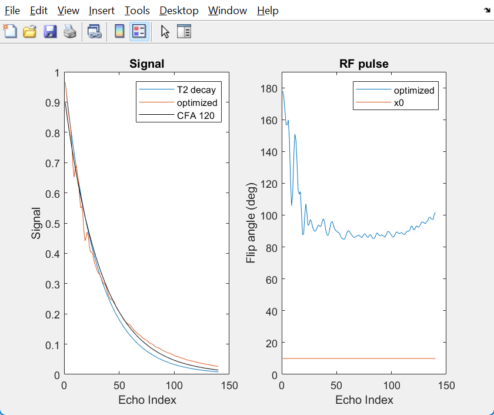

# SNR-enhanced whole-brain chemical exchange saturation transfer imaging by optimized variable flip angles 

## Flip angle optimization
`main_optimize_SNR_optimal_control.m` solves the following problem

$$
\min_{\mathrm{FA}} \left( -\frac{a}{2}\sum_{i=1}^{N-1}(s_iw_i)^2 + \frac{b}{2}\frac{\sum_{i=1}^{N-1}\sum_{j=1}^{N-1}(s_i-s_j)^2}{\sum_{i=1}^{N-1}s_i^2} \right) \quad \text{s.t.} \quad 0 \le \mathrm{FA} \le 180^\circ
$$


The code can run in two different modes (1) SNR+Res (2) Res-only by setting
```matlab
% SNR+Res
SNR_obj_weight = 1;
res_obj_weight = 2e-4;
```
or
```matlab
% Res-only
SNR_obj_weight = 0;
res_obj_weight = 1;
```
The resulting signal and flip angles in SNR+Res mode is 
